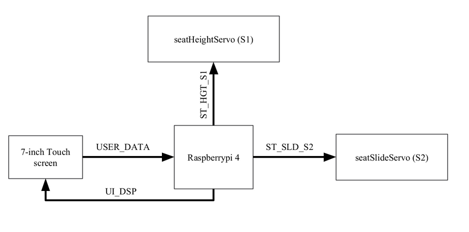

# Seat-Auto-Adjustment
## Project Objective 
This project is a component of my on-the-job training at SeiTech Solutions. project primary objective is to gain familiarity with embedded Linux and the Yocto Project.

## Repo Tree 
```sh
.
├── App_GUI_Develoment
├── Main App Development
│   ├── application Development
│   └── Unit_tests
├── README.md
├── Yocto Project Quick Start
│   ├── LAB2_Layers
│   ├── LAB3_Graphics
│   ├── LAB4_WiringPi
│   ├── Lab1_Getting Start With Yocto Project
│   └── README.md
├── assets
└── rpi_projectBuild
```
This repository contains the following directories:
- `App_GUI_Development`: Directory for developing the graphical user interface `(GUI)` application based on `QT5` and run it through windows machine.
- `App Development`: 
    - Directory for developing the `main application` logic 
    -  Directory for unit tests on application based on `gtest` framework.
- `Yocto Project Quick Start`: Contains labs and resources for quickly getting started with the Yocto Project, including guides for different aspects like layers, graphics, and utilizing `so` libs.
- `assets`: Directory for storing additional project assets.
- `rpi_projectBuild`: Directory of Yocto build for Raspberry Pi project.
## Project Requirements 
### Problem statement 
Automatically adjust the seat for optimal comfort and safety based on the driver's physical characteristics.
### User needs
- Easy user interface for entering the inputs.
- Auto-positioning with less manual modifications.
- Easy feedback process after positioning.
- Comfort seat position for driving, holding the pedal, and clear vision.
### Guidelines
#### All Possible Conditions 
- If minimum average <= weight & height =< maximum average 🡪 standard seat position.

- If height <= minimum average 🡪 seat higher and further front.

- If height >= maximum average 🡪 seat lower and further back.

- If weight <= minimum average 🡪 decreased lumbar support and a slightly raised backrest.

- If weight >= maximum average 🡪 increased lumbar support and a slightly reclined backrest.  

#### Seat Parameters


## Project Architecture
### System Architecture

### Software Architecture

### Project Layers based on Linux Layered Architecture

### System Partitioning

### System Sequence diagram


### Project Details 
#### Project setup tree 
```sh
rpi_projectBuild
├── myLayers
│   ├── meta-graphics
│   ├── meta-rpihw
│   └── meta-shell
└── rpi3_build
    ├── bitbake-cookerdaemon.log
    ├── cache
    ├── conf
    └── tmp
```
#### Image development 
My customized image builds upon the `core-image-minimal` configuration with some extras located in [`local.conf`](./rpi_projectBuild\conf\local.conf) 

#### Unit test coverage report 
can find full unit test report from [HERE](./Main%20App%20Development/Unit_tests/coverage/src/app/) 


### OUTPUT

> Weston gui


> QT5


## Contributing  
Bug reports, feature requests, and so on are always welcome. Feel free to leave a note in the Issues section.