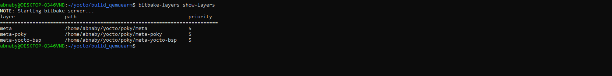
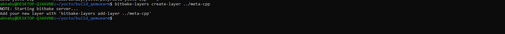
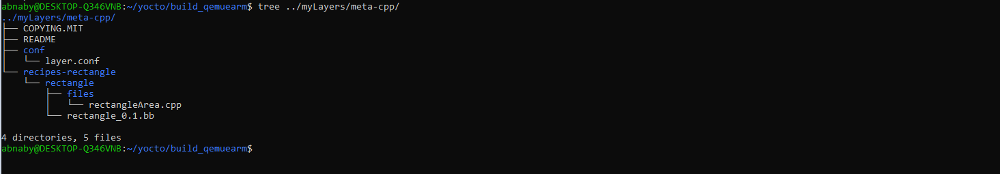
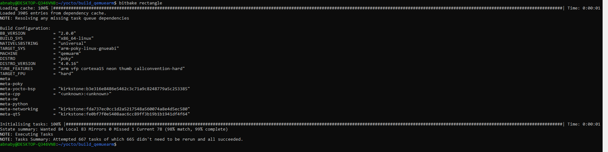
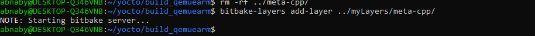
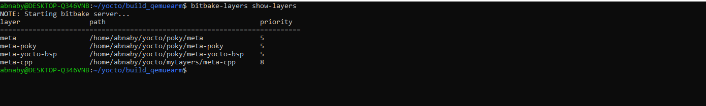
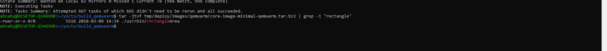

# LAB2 - Creating Custom layer 
## Steps 
### 1. Show Current layers  
```sh
poky> source oe-init-build-env "../build_qemuarm/"
build_qemuarm> bitbake-layers show-layers 
```


## 2. Create Custom layer  
### Create Custom layer 
```sh
build_qemuarm> bitbake-layers create-layer "LAYER_PATH"
```
The layer name must start with `meta-`layerName
  

We can pass 'o' option to change the name of generated recipe
```sh
recipetool create -o test_recipe.bb rectangle_1.0.bb
```
or make it manually. 

### layer folder structure  

  
`conf` 

`conf/layer.conf` 
- identifies the file structure as a layer 
- identifies the contents of the layer, and contains information about how the build system should use it 

```sh 
# conf and classes directory (LAYERDIR) <--  Current Dir 
BBPATH .= ":${LAYERDIR}"

# Recipes name be  recipes-*
BBFILES += "${LAYERDIR}/recipes-*/*/*.bb \
            ${LAYERDIR}/recipes-*/*/*.bbappend"
# Container Name 
BBFILE_COLLECTIONS += "meta-gcc"

# must be suffixed with the name of the specific layer expends during process in BBFILES
BBFILE_PATTERN_meta-cpp = "^${LAYERDIR}/"

# Establishes a priority to use for recipes
BBFILE_PRIORITY_meta-cpp  = "8"

# Optionally, you can specify a specific layer version for a dependency by adding it to the end of the layer name
LAYERDEPENDS_meta-cpp = "core"

# This variable is a good way to indicate if your particular layer is current.
LAYERSERIES_COMPAT_meta-cpp = "kirkstone"

```
`meta-cpp/`
- List all recipes belong this layer inside this folder   

`recipes-rectangle/`  
-  `rectangle/files` hold all src files related to recipe named rectangle
-  `rectangle_xx.yy.zz.bb`   
file content 
``` sh
SUMMARY = "Recipe for C++ apps"
DESCRIPTION = "This Recipe contain all source file related to c++"
LICENSE = "CLOSED"

# Locate the src files using file: when the file exist in local machine
# example to git the files from server 
# SRC_URI = "git://git.adelielinux.org/adelie/gcompat.git;protocol=https;branch=current"
# For Local machine:   
SRC_URI = "file://rectangleArea.cpp"

# The location in the Build Directory where unpacked recipe source code resides
# WORKDIR > build_qemuarm/tmp/work/
S = "${WORKDIR}"

# This task runs with the current working directory set to ${B}. (Build dir)
do_compile() {
    ${CXX} ${CXXFLAGS} ${LDFLAGS} rectangleArea.cpp -o rectangleArea
}
do_install() {
    install -d ${D}${bindir}
    install -m 0755 rectangleArea ${D}${bindir}
}
```
`do_compile`: The default behavior of this task is to run the oe_runmake function if a makefile (Makefile, makefile, or GNUmakefile) is found. If no such file is found, the do_compile task does nothing.  
`do_install` Copies files that are to be packaged into the holding area ${D} `/image`.

## 3. Verify the recipe    
```sh
build_qemuarm> bitbake rectangle
```
 

## 4. Add Layer to build dir 
```sh
build_qemuarm> bitbake-layers add-layer "../meta-cpp" 
build_qemuarm> bitbake-layers show-layers 
```
 
 

## 5. Add the recipe into your image 

```sh
build_qemuarm> nano conf/local.conf
```
Insert the recipes names 
```sh
IMAGE_INSTALL:append = " rectangle"
```
Don't forget to add `space` after first `"`

## 6. Build image and check the tar file

```sh
bitbake core-image-minimal
tar -jtvf tmp/deploy/images/qemuarm/core-image-minimal-qemuarm.tar.bz2 | grep -i "rectangle" 
```
 


## 4. Run Qemu 
### Locate the executable location 
Under `/usr/bin` due to `${bindir}` variable 

### Output
 

## Resources 
* [yocto project doc](https://docs.yoctoproject.org/dev/ref-manual/tasks.html#ref-tasks-compile)
* [Variables Glossary](https://docs.yoctoproject.org/dev/ref-manual/variables.html#term-D)
* [How to prepare a ‘helloworld.c’ recipe with Yocto Project](https://george-calin.medium.com/how-to-prepare-a-helloworld-c-recipe-with-yocto-project-1f74c296a777)
* [Lab 02_Creating Custom layer and writing Recipe for Hello world](https://medium.com/@lokeshsharma596/yocto-lab-02-creating-custom-layer-and-writing-recipe-for-hello-world-f4438311bbfc)
