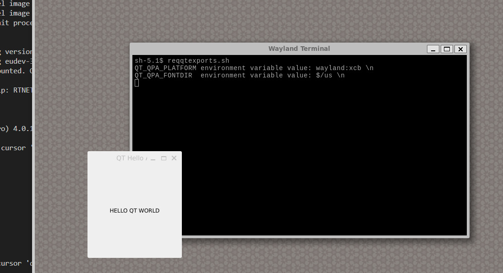
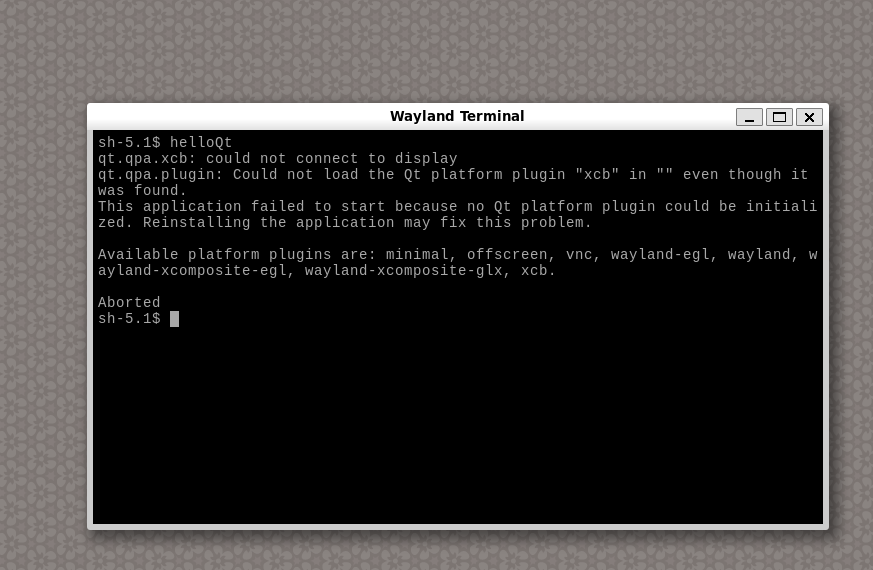
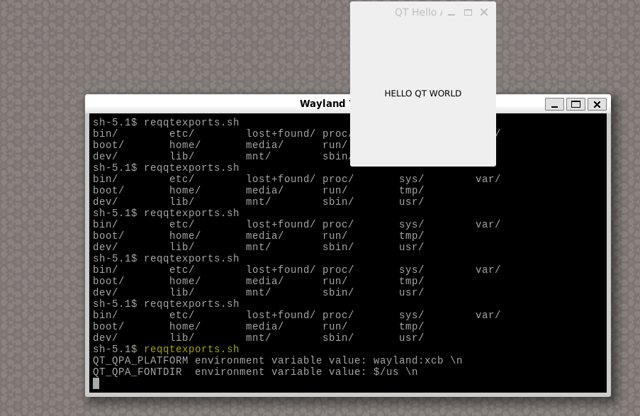

# LAB3 - Hello Qt App 
## Start with `QT`
any `QT` app must have atleast two files one for source code and another the project file  
In Qt, a project file (.pro file) is used to describe your project's structure, dependencies, and build configuration. It's essentially a configuration file that Qt's build system (qmake) uses to generate Makefiles for building your application.

`helloQt.cpp`
```cpp
#include <QApplication>  // Include the QApplication header for managing the application
#include <QLabel>        // Include the QLabel header for displaying text
#include <QWidget>       // Include the QWidget header for creating windows

// Entry point of the application
int main (int argc, char *argv[])
{
    // Create the application object
    QApplication app(argc, argv);  

    // Create a QLabel widget with a centered text
    QLabel hello("<center>HELLO QT WORLD</center>");

    // Set the window title
    hello.setWindowTitle("QT Hello App");

    // Set the initial size of the window
    hello.resize(200, 200);

    // Display the window
    hello.show();

    // Start the event loop of the application and wait for events
    return app.exec();
}
```
`helloQt.pro`
```sh
# This is a sample Qt project file (.pro) for building a simple Qt application.

# Set the type of project (app, lib, etc.)
TEMPLATE = app

# Specify the name of the output binary (executable or library)
TARGET = helloQt

# Specify the include path for header files (current directory in this case)
INCLUDEPATH += .

# Specify the Qt modules required by the application
QT += gui widgets

# Add a define to enable deprecated warnings from Qt
DEFINES += QT_DEPRECATED_WARNINGS

# List the source files (.cpp files) that are part of the project
SOURCES += helloQt.cpp

``` 
then run qmake to generate makefile 
```sh
qmake qt.pro
make
```
it will generate executable under name `helloQt` run it through 
```sh
./helloQt
```


## Integrate with custom image  
### 1. Create Layer 
We will Create a layer under name of meta-graphics
```sh
bitbake-layers create-layer meta-graphics
bitbake-layers add-layer meta-graphics
```  
### layer folder structure  
```sh
meta-graphics/
├── COPYING.MIT
├── README
├── conf
│   └── layer.conf
└── recipes-qtapp
    └── qtapp
        ├── files
        │   ├── helloQt.cpp
        │   └── helloQt.pro
        └── qtapp.bb
```
## 2. Write `bb` file 
write the basic variables 
```sh
SUMMARY = "Simple GUI application"
DESCRIPTION = "A simple GUI application using QT5"
LICENSE = "CLOSED"

SRC_URI = "file://helloQt.cpp \
           file://helloQt.pro \
          "

S = "${WORKDIR}"
```
write the QT5 dependencies 
```sh
DEPENDS += "qtbase wayland "
```
`wayland` is a communication protocol that specifies the communication between a display server and its clients.  

install app in `/usr/bin`
```sh
do_install:append () {
    install -d ${D}${bindir}
    install -m 0755 helloQt ${D}${bindir}
}
```
inhrit the qmake for building process 
```sh
inherit qmake5
```

## 2. Verify the recipe    
```sh
bitbake qtapp
```  
## 4. `Local.conf` file 
### add wayland to distro 
```sh
DISTRO_FEATURES:append = " x11 wayland"
```
### Image EXTRA_INSTALL
```sh
CORE_IMAGE_EXTRA_INSTALL += " wayland weston"
```
- Wayland is a protocol that specifies the communication between a display server and its clients. Wayland is intended as a simpler replacement for the X Window system, easier to develop and maintain.
- Weston is the reference implementation of a Wayland compositor that is a display server using the Wayland protocol.  
Weston is a minimal and fast compositor and is suitable for many embedded and mobile use cases.

### Add app to image 
```sh
IMAGE_INSTALL:append = " qtapp qtbase qtwayland"
```
## 4. Run Qemu 
```sh
runqemu serialstdio
```
### Output
 

## Notes 
-  For `Can not connect display` error 
 
you need to export 
```sh
export QT_QPA_PLATFORM=wayland:xcb
```
- for ` Can't find font directory` problem 
you need to add the required fonts into your image 
```sh 
IMAGE_INSTALL:append = "\
    ttf-dejavu-sans \
    "
```
```sh
bitbake core-image-minimal
```
then inside weston GUI 
```sh
export QT_QPA_FONTDIR=/usr/share/fonts/truetype
```

or you can add meta-shell layer into environment and add the recipe `reqqtexports.sh` into your image then hit 
```sh
./reqqtexports.sh
```
```sh
#!/bin/bash
export QT_QPA_PLATFORM=wayland:xcb
export QT_QPA_FONTDIR=/usr/share/fonts/truetype
echo "QT_QPA_PLATFORM environment variable value: $QT_QPA_PLATFORM \n"
helloQt
```
 
## Resources 
* [yocto project doc](https://docs.yoctoproject.org/dev/ref-manual/tasks.html#ref-tasks-compile)
* [Variables Glossary](https://docs.yoctoproject.org/dev/ref-manual/variables.html#term-D)
* [Compiling a QT application](https://www.youtube.com/watch?v=2HyUCWOQhr8)
* [ How can i create GUI for my yocto project using Qt? ](https://www.reddit.com/r/embeddedlinux/comments/11i56yx/how_can_i_create_gui_for_my_yocto_project_using_qt/)