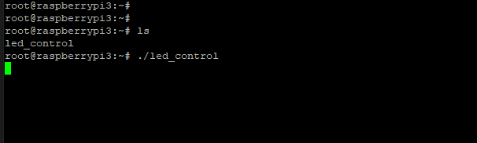

image# LAB4- WiringPi 
## What is WiringPi
WiringPi is a performant GPIO access library written in C for Raspberry Pi boards.

## Problem Statement 
The apps contain the `wiringPi` lib should be compiled and run into rpi. 
So, we have two ways  
1. Compile the lib itself using cross tool chain 
* Can follow this [Reference](https://medium.com/@au42/he-useful-raspberrypi-cross-compile-guide-ea56054de187)  
Honestly I don't have much time to go through this method.
2. Using Normal method but with tricky points.

In this `md` file i will introduce the second method

## The Idea 
The concept is straightforward: we'll utilize the Raspberry Pi (rpi) as usual for development purposes. Once we have an executable file, we'll integrate it directly into our custom image and create a recipe to include the necessary `.so` libraries into our root file system (`rootfs`).   
This approach ensures seamless integration of our custom software with the target environment, allowing for efficient development and testing on the Raspberry Pi platform.

## Installation on `rpi`
Here is steps
```sh
# clone from the source
git clone https://github.com/WiringPi/WiringPi.git
cd WiringPi
# build the package
./build clean
./build
```
for core-image-minimal custom images  
you need to configure workspace before run `./build`   
```sh
mkdir /usr/local/
mkdir /usr/local/include/
mkdir  /usr/local/lib/
export CC=arm-poky-linux-gnueabi-gcc
export MAKE=make
```

## Change LED Brightness 
```c
#include <iostream>
#include <wiringPi.h>

#define LED_PIN 18 // GPIO pin connected to the LED

int main(void) {
    int brightness = 0; // Initialize brightness to 0

    // Initialize WiringPi library
    if (wiringPiSetupGpio() == -1) {
        std::cerr << "Error initializing WiringPi" << std::endl;
        return 1;
    }

    // Set the LED pin as PWM output
    pinMode(LED_PIN, PWM_OUTPUT);

    // Main loop
    while (1) {
        // Increase brightness (fade in)
        for (brightness = 0; brightness <= 1023; brightness++) {
            pwmWrite(LED_PIN, brightness);
            delay(5); // Delay for smooth transition
        }

        // Decrease brightness (fade out)
        for (brightness = 1023; brightness >= 0; brightness--) {
            pwmWrite(LED_PIN, brightness);
            delay(5); // Delay for smooth transition
        }
    }

    return 0;
}
```
to get the excutable file 

```sh
g++ -o led_control led_control.cpp -lwiringPi
```
Run program 
```sh
./led_control 
```
## Required shared object files 
There are two `so` files provided by `wiringpi`  
* libwiringPi.so 
* libwiringPiDev.so 
under path `/usr/lib`

## Custom Recipe 
I will create a custom recipe to add these `so` files into my image `rootfs`
### Recipe Structure 
```sh
./meta-rpihw/
├── COPYING.MIT
├── README
├── conf
│   └── layer.conf
└── recipes-wiringpi
    └── wiringPi
        ├── files
        │   └── lib
        │       ├── libwiringPi.so
        │       └── libwiringPiDev.so
        └── wiringpi_0.1.bb
```
### Breakout `wiringpi` recipe content

#### Define essentials  
```sh
SUMMARY = "Prebuilt WiringPi Library"
DESCRIPTION = "Prebuilt WiringPi library and binaries for Raspberry Pi."
LICENSE = "CLOSED"
```
#### Define the Suffix of shared object 
in our case `so`
```sh
SOLIBS = ".so"
FILES_SOLIBSDEV = ""
```
#### install into img rootfs
* the  `${libdir}` var hold path `/usr/lib`  
* the `${ABS_PATH_TO_FILES}` var hold the absolute address of `lib` folder  
```sh
do_install() {
    # Create directory in the rootfs for library files
    install -d ${D}/usr/lib
    # Install library files to the rootfs directory
    install -m 0755 ${ABS_PATH_TO_FILES}/lib/* ${D}${libdir}
}
```

#### Define files to the package 
```sh
FILES_${PN} += "${libdir}/libwiringPi.so"
FILES_${PN} += "${libdir}/libwiringPiDev.so"
```
### Verify `wiringpi` recipe content
```sh
bitbake wiringpi 
```
if everything is okay, just add the recipe into your image 

```sh
IMAGE_INSTALL:append = " wiringpi"
```
### Test the recipe 
move the application into image using `winSCP` and change mode 
```sh
chmod +x led_control 
```
 
LED FADE IN/OUT CORRECTLY.

## Resources 
* [Working with Pre-Built Libraries](https://docs.yoctoproject.org/4.0.17/dev-manual/prebuilt-libraries.html)
* [Stack overflow](https://unix.stackexchange.com/questions/746814/how-do-i-edit-etc-ld-so-conf-in-a-yocto-recipe)
* [Using Cross Compiler](https://medium.com/@au42/he-useful-raspberrypi-cross-compile-guide-ea56054de187)  
* [Introduction to WiringPi (for Raspberry Pi)](https://roboticsbackend.com/introduction-to-wiringpi-for-raspberry-pi/)
* [Useful debugging info with bitbake](https://adrianalin.gitlab.io/popsblog.me/posts/building-embedded-systems-for-raspberry-pi3-with-yocto/)